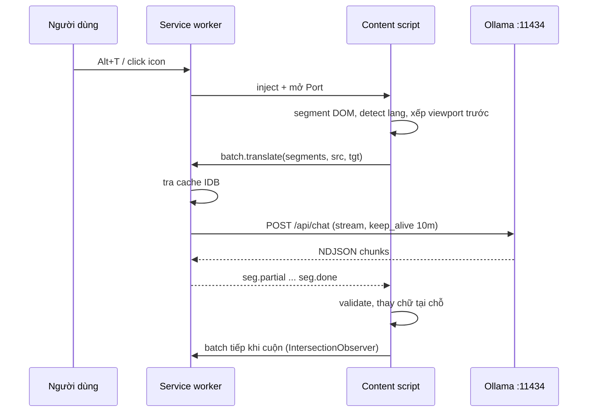
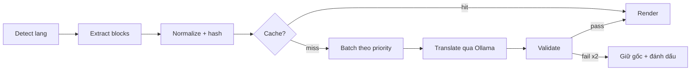
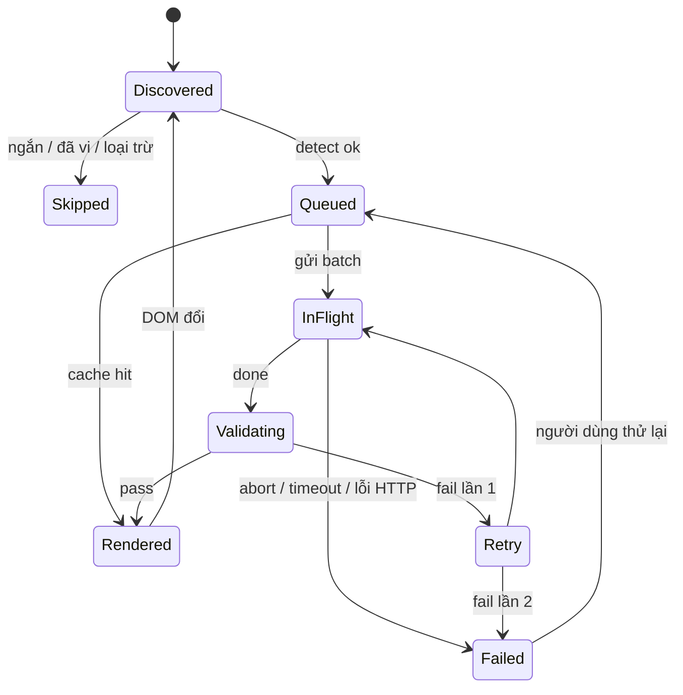

# Spec — Snagon - Dịch AI (Chrome Extension × Ollama local)

2026-09-21 · Phát (soạn cùng Claude)

## 1. Tóm tắt & quyết định chốt

Xây một Chrome extension MV3 riêng, gọi thẳng Ollama native API (`POST /api/chat`, streaming NDJSON) từ background service worker, dịch trang theo khối (block-level) ưu tiên viewport, **thay thế tại chỗ như Google Translate** (hover hiện bản gốc), nguồn EN/RU/ZH/TH → VI, dịch hết không chừa thuật ngữ. Máy đích là MacBook Pro M5 Pro 64 GB unified memory, Ollama 0.34.2: model mặc định `gemma4:26b` (MoE, profile B) và `translategemma:12b` (profile A), `translategemma:27b` cho chế độ chất lượng cao — quyết định cuối theo bake-off ở milestone M3 (§8).

Điểm mấu chốt cần nói thẳng: lỗi ngữ pháp tiếng Việt của Google Translate là lỗi **model**, không phải lỗi extension. Extension chỉ là plumbing (bóc text → gửi → trả về đúng chỗ). Giá trị thật nằm ở ba chỗ: (1) tự chọn model và kiểm soát prompt về văn phong tiếng Việt + thuật ngữ chuyên ngành; (2) chạy 100% local, không phụ thuộc dịch vụ bị site chặn; (3) xử lý lỗi minh bạch, không dịch sai âm thầm. Vì vậy spec dành nhiều dung lượng cho model, prompt và hiệu năng hơn cho UI.

Ràng buộc vật lý chi phối toàn bộ thiết kế: một bài 1.000 từ tiếng Anh sinh khoảng 2.000 token tiếng Việt; trên M5 Pro ước tính \~36 s với `gemma4:26b` (≈55 tok/s) và \~67 s với `translategemma:12b` (≈30 tok/s), còn context window không phải nút thắt (§7.3). Dịch theo viewport rồi lazy khi cuộn là **bắt buộc**, không phải tối ưu tùy chọn.

| # | Quyết định | Chọn | Vì sao | Phương án bị loại |
| --- | --- | --- | --- | --- |
| 1 | Nền tảng | Chrome MV3 (Chromium-only), TypeScript, WXT (Vite), không UI framework trong content script | Chuẩn hiện hành, hot-reload; Edge/Arc/Brave chạy được ngay | MV2 (Chrome đã gỡ), Firefox port |
| 2 | Build vs reuse | Tự xây; mượn **ý tưởng** (không mượn code) từ Read Frog, KISS Translator | Cần native Ollama API (`think`, `format`, `keep_alive`), template TranslateGemma, fail-closed; tránh ràng buộc GPLv3 | Fork Read Frog (GPLv3 + commercial, nặng), KISS (chỉ endpoint OpenAI-compatible) |
| 3 | Nơi gọi Ollama | Background service worker (extension origin) | Content script mang origin của trang → Ollama trả 403 CORS, CSP `connect-src` của trang chặn | fetch từ content script |
| 4 | CORS | `OLLAMA_ORIGINS=chrome-extension://<id cố định>`, khóa ID bằng trường `key` trong manifest | Cách Ollama khuyến nghị chính thức; scope hẹp hơn `*` | Rewrite header Origin bằng declarativeNetRequest (giữ làm fallback tùy chọn v1.1) |
| 5 | Đơn vị dịch | Block-level; inline tags → placeholder `<1>…</1>` có validate, fallback plain text | Giữ định dạng mà không để model phá HTML | Dịch từng text node (vỡ ngữ pháp); gửi innerHTML thô |
| 6 | Thứ tự dịch | Viewport trước, lazy khi cuộn, tối đa 2 request in-flight | Ngân sách token §8; `OLLAMA_NUM_PARALLEL` mặc định 1 | Dịch cả trang một lượt |
| 7 | Hiển thị | **Replace mode mặc định**: thay text tại chỗ như Google Translate, hover hiện gốc, một phím khôi phục; song ngữ là tùy chọn (M4) | Anh yêu cầu trải nghiệm giống Google Translate | Song ngữ mặc định |
| 8 | Model & prompt | Hai profile: **A** `translategemma` (template cố định, 1 segment/request); **B** `instruct-json` (Gemma 4 / Qwen3.5: system prompt + context trang + JSON schema). **Không glossary, dịch hết** | A: chất lượng trên mỗi GB tốt nhất; B: batch, context, cấu trúc ép bằng schema | Một profile duy nhất; glossary/danh sách giữ thuật ngữ |
| 9 | Cache | IndexedDB ở extension origin (trong SW); key = hash(model, prompt\_version, src, tgt, text); LRU 100 MB, TTL 30 ngày | Dùng chung mọi site; IDB của content script bị tách theo origin trang | `chrome.storage.local` (giới hạn 10 MB) |
| 10 | Quyền | `activeTab` + `scripting` inject theo yêu cầu; `host_permissions` chỉ endpoint Ollama; auto-translate theo domain qua `optional_host_permissions` (M3) | Không xin `<all_urls>` | `content_scripts` tĩnh trên mọi site |
| 11 | Tham số Ollama | `num_ctx` 8192 cố định mọi request; `keep_alive` 10m; `stream` true; `think: false` luôn gửi ở profile B (Ollama chỉ trả 400 khi *bật* think trên model không hỗ trợ) | Đổi `num_ctx` giữa request khiến Ollama nạp lại model; context mặc định trên máy 64 GB là 256K, quá lớn | Context mặc định / keep\_alive 5m |

## 2. Mục tiêu, phạm vi v1, ngoài phạm vi

Mục tiêu v1: đọc bài EN/RU/ZH bằng tiếng Việt tự nhiên ngay trong tab đang mở, bản dịch đầu tiên hiện dưới 3 s khi model đã warm, không một byte nội dung nào rời máy. Người dùng là một power-user duy nhất: cấu hình sâu là chấp nhận được, không cần onboarding đại chúng, không publish Chrome Web Store (load unpacked hoặc đóng gói `.crx`).

Bối cảnh sử dụng: tài liệu kỹ thuật và tài chính tiếng Anh; portal seller và tài liệu thuế tiếng Nga (nhiều trang cần đăng nhập — content script chạy ngay trong tab đã đăng nhập nên không bị ảnh hưởng); nguồn tiếng Trung. Site chặn Google Translate không liên quan ở đây: trang đã nằm trong trình duyệt, extension chỉ đọc DOM và gọi `127.0.0.1`.

| Mục tiêu | Chỉ số nghiệm thu |
| --- | --- |
| Dịch toàn trang thay thế tại chỗ | ≥ 95% khối văn bản hiển thị được dịch; 0 khối vỡ layout trên 20 trang mẫu (§12) |
| Nhanh cảm nhận được | Bản dịch đầu tiên (viewport) < 3 s khi model warm; < 12 s khi cold-load model 19 GB từ SSD |
| Đúng ngữ pháp tiếng Việt | Fluency trung bình ≥ 4/5 trên golden set 120 đoạn (Phát chấm mù), thắng Google Translate ở ≥ 60% số đoạn |
| Không sai âm thầm | 100% segment lỗi giữ nguyên gốc và được đánh dấu; không hiển thị output chưa qua validator (§5.6) |
| Khôi phục nguyên vẹn | DOM sau “Khôi phục” bằng DOM trước khi dịch; hover luôn hiện đúng bản gốc của khối |
| Riêng tư | 0 kết nối ra ngoài `host_permissions`, kiểm bằng DevTools Network của service worker trên 20 trang mẫu |
| Sống qua sự cố | Chrome kill service worker giữa job → job tự tiếp tục, không mất segment (§7.4) |

**Trong phạm vi v1**

- Nguồn: `en`, `ru`, `zh` (tự phân biệt Hans/Hant), `th`; đích: `vi`. Nguồn khác dịch best-effort nếu model hỗ trợ, không cam kết.
- Kích hoạt: click icon, phím tắt `Alt+T`, context menu “Dịch trang này”; dịch vùng chọn qua `Alt+S` hoặc context menu, hiện popover tại chỗ.
- Replace mode (mặc định, trải nghiệm như Google Translate): thay text ngay trong khối gốc, giữ layout và inline format; hover khối → tooltip bản gốc; `Alt+H` đảo nhanh gốc/dịch toàn trang; khôi phục nguyên trạng một click. Song ngữ là tùy chọn ở M4.
- Dịch hết: mọi văn bản hiển thị kể cả thuật ngữ chuyên ngành; chỉ giữ nguyên số, URL, email, mã code và placeholder. Không có glossary hay danh sách bỏ qua.
- Nội dung động (SPA, infinite scroll) được dịch tiếp khi xuất hiện; same-origin iframe và open shadow root được duyệt.
- Options: endpoint Ollama, chọn model từ `/api/tags`, profile prompt, style, site rules (M3: auto-translate theo domain, selector loại trừ).
- Cache dịch cục bộ; chẩn đoán kết nối kèm lệnh sửa chính xác cho macOS.

**Ngoài phạm vi (và vì sao)**

- Glossary / danh sách giữ thuật ngữ: không (anh chọn dịch hết). Kiến trúc profile B vẫn để chỗ chèn sau nếu đổi ý.
- PDF viewer của Chrome, ảnh/OCR, subtitle video: khác pipeline. TranslateGemma có vision nên OCR-dịch ảnh là ứng viên v2.
- Dịch ngược chiều khi soạn thảo (vi → en/ru/zh/th trong input box): cần profile và UI khác, v2.
- Cross-origin iframe: cần host permission cho origin đó, đi theo site rules M3.
- Đồng bộ cloud, tài khoản, telemetry: không bao giờ.
- Publish Chrome Web Store, mobile, Firefox: không. Chromium-only (Chrome, Edge, Arc, Brave dùng chung bản build).

Non-goal cần nói rõ: không kỳ vọng model local đạt độ chính xác pháp lý cho văn bản thuế tiếng Nga. Tooltip bản gốc khi hover và `Alt+H` tồn tại chính là để đối chiếu gốc ở những đoạn quan trọng mà không rời khỏi trải nghiệm thay thế.

## 3. Build vs reuse

Verdict: tự xây, nhưng **dùng thử [Read Frog](https://github.com/mengxi-ream/read-frog) hoặc [KISS Translator](https://github.com/fishjar/kiss-translator) trỏ vào Ollama trong 1–2 ngày trước khi viết dòng code nào** — đó là baseline miễn phí để tách bạch hai câu hỏi: chất lượng tiếng Việt kém là do model hay do plumbing. Nếu baseline đã đọc được, phần còn thiếu chỉ là 4 điểm ở bảng dưới; nếu baseline tệ với cùng model, extension mới cũng sẽ tệ — phải đổi model/prompt trước.

| Tiêu chí | Read Frog | KISS Translator | Immersive Translate | Tự xây (spec này) |
| --- | --- | --- | --- | --- |
| Mã nguồn / license | Mở, GPLv3 + commercial dual-license | Mở, GPL-3.0 | Đóng, freemium | Toàn quyền, không nghĩa vụ copyleft |
| Ollama | Provider riêng qua Vercel AI SDK | Chỉ endpoint OpenAI-compatible của Ollama | Custom OpenAI-compatible | Native `/api/chat`: dùng được `think`, `format` JSON schema, `keep_alive`, `/api/show` capabilities |
| Template TranslateGemma (single user message, 2 dòng trống) | Không đảm bảo (prompt chung) | Không đảm bảo | Không | Có, profile A |
| Glossary / site rules | Custom prompt, site rules | Terminology + rules theo site, visual selector | Có | Glossary chỉ đưa term xuất hiện trong batch vào prompt; rules theo domain |
| Validate output, fail-closed | Mức cơ bản | Mức cơ bản | Không rõ | Tag integrity, echo, length ratio, repetition → giữ gốc (§5.6) |
| Độ nặng | Monorepo, tài khoản, Notebase, TTS, learning features | React + MUI, nhiều dịch vụ cloud | N/A | Một việc, không tài khoản, không cloud |
| Chi phí đến khi dùng được | 15 phút cài + set `OLLAMA_ORIGINS` | 15 phút | 15 phút | M0–M2 ≈ vài phiên Claude Code |

Lý do tự xây thay vì fork:

1. Hai extension mở đều đi qua lớp OpenAI-compatible hoặc SDK chung, nên không kiểm soát được `think:false`, `format` schema, `keep_alive`, `num_ctx` cố định — đúng những núm ảnh hưởng latency và độ tin cậy trên máy local.
2. TranslateGemma yêu cầu một user message duy nhất theo template cố định; prompt “chung cho mọi provider” của các extension kia làm giảm chất lượng model này.
3. GPLv3: fork để dùng riêng thì hợp lệ, nhưng nếu sau này đóng gói bán (anh đang làm marketplace skill/plugin) thì mọi mã dẫn xuất phải mở theo GPLv3. Viết mới tránh hẳn rủi ro này.
4. Codebase của Read Frog lờn hơn nhiều so với nhu cầu; thời gian hiểu để sửa sâu (segmenter, lifecycle) không rẻ hơn viết lại phần lõi vài nghìn dòng.

Những gì **mượn ý tưởng** (đọc code để học, không copy): quy tắc chọn block dịch và danh sách tag loại trừ; cách đánh dấu node đã dịch để MutationObserver không tự kích (Read Frog v1.40 vừa sửa “retranslation storm” — bằng chứng đây là lỗi thực tế); chèn batch bản dịch bằng DocumentFragment để giảm reflow; cơ chế site rules bằng CSS selector.

Thư viện sử dụng (không tự viết lại): [WXT](https://wxt.dev) (khung MV3), `idb` (wrapper IndexedDB), Vitest, Playwright. Không dùng Vercel AI SDK: thêm một lớp trừu tượng chỉ để gọi một endpoint duy nhất là không đáng.

## 4. Kiến trúc tổng thể

Ba runtime, một chiều tin cậy: content script (đọc/ghi DOM, không mạng) nối qua long-lived `Port` tới service worker (client Ollama duy nhất, hàng đợi, cache), service worker gọi Ollama ở `127.0.0.1:11434`. Popup và Options chỉ đọc/ghi `chrome.storage` và gửi lệnh. State của job dịch sống ở content script (cùng vòng đời với trang); service worker là worker không trạng thái vì Chrome có thể kill nó bất kỳ lúc nào (§7.4).

| Thành phần | Chạy ở | Trách nhiệm | Không được làm |
| --- | --- | --- | --- |
| Content script `content/` | Isolated world của trang, `all_frames: true` | Segment DOM; phát hiện ngôn ngữ (`chrome.i18n.detectLanguage` + `<html lang>`); IntersectionObserver xếp ưu tiên viewport; MutationObserver cho nội dung động; render thay thế tại chỗ (hoặc song ngữ); giữ state job của tab | Gọi mạng; parse output model thành HTML |
| Service worker `background/` | Extension origin | Ollama client (fetch streaming + `AbortController`); hàng đợi ưu tiên, tối đa 2 in-flight; cache IDB; `/api/tags`, `/api/show`, `/api/version`; chẩn đoán lỗi; context menu, phím tắt; inject content script qua `chrome.scripting` | Giữ state job trong biến toàn cục |
| Popup | Extension page | Bật/tắt dịch tab hiện tại, chọn model nhanh, trạng thái kết nối, tiến độ (segment xong/tổng, cache hit) | Logic dịch |
| Options | Extension page | Endpoint, model, profile, style, glossary, site rules, export/import JSON, nút “Kiểm tra kết nối” | — |

Ranh giới tin cậy (trust boundary): (1) DOM trang → content script: văn bản trang là dữ liệu không tin cậy và là bề mặt prompt injection; (2) content script ↔ service worker: mọi message qua schema validate (`jobId`, `tabId`, `frameId`, kiểu); (3) service worker ↔ Ollama: output model là dữ liệu không tin cậy, chỉ đi vào DOM qua `textContent` và cây placeholder được dựng bằng `createElement`, không bao giờ qua `innerHTML`.



Mỗi batch là một request riêng; cache hit trả về ngay không chạm Ollama; port đóng (tab đóng/navigate) → service worker abort toàn bộ fetch của `jobId` đó.

| Message | Hướng | Payload chính |
| --- | --- | --- |
| `job.start` | CS → SW | `jobId`, `tabId`, `frameId`, `src`, `tgt`, `profile`, `model`, `url` |
| `batch.translate` | CS → SW | `jobId`, `batchId`, `segments[{id, text, tokensEst}]`, `priority` (0 = viewport) |
| `seg.partial` / `seg.done` / `seg.error` | SW → CS | `jobId`, `segId`, `text` hoặc `code` (§11) |
| `job.cancel` | CS/Popup → SW | `jobId` |
| `status` | SW → Popup | `ollama: ok / down / cors / model_missing / busy`, `model`, `inflight`, `cacheHitRate` |
| `config.changed` | SW → CS | snapshot config (model, profile, style) |

Manifest rút gọn (WXT sinh ra từ `wxt.config.ts`, giữ đúng các khóa này):

```json
{
  "manifest_version": 3,
  "name": "Snagon - Dịch AI",
  "short_name": "Snagon Dịch",
  "version": "0.1.0",
  "minimum_chrome_version": "144",
  "key": "<public key để cố định extension ID>",
  "permissions": ["activeTab", "scripting", "storage", "contextMenus", "unlimitedStorage"],
  "host_permissions": ["http://127.0.0.1:11434/*", "http://localhost:11434/*"],
  "optional_host_permissions": ["http://*/*", "https://*/*"],
  "background": { "service_worker": "background.js", "type": "module" },
  "action": { "default_popup": "popup.html" },
  "options_ui": { "page": "options.html", "open_in_tab": true },
  "commands": {
    "translate-page": { "suggested_key": { "default": "Alt+T" }, "description": "Dịch / khôi phục trang" },
    "toggle-original": { "suggested_key": { "default": "Alt+H" }, "description": "Đảo gốc / dịch" },
    "translate-selection": { "suggested_key": { "default": "Alt+S" }, "description": "Dịch vùng chọn" }
  }
}
```

Ghi chú manifest: `key` giữ extension ID không đổi giữa các lần load unpacked để `OLLAMA_ORIGINS` scope được đúng một ID (lấy public key từ Developer Dashboard hoặc sinh bằng `openssl`, ID suy ra từ key). `minimum_chrome_version` 144 vì các cải tiến lifecycle service worker (port giữ SW sống từ Chrome 114, alarms 30 s từ 120) và vì Chrome 142–143 có lỗi Local Network Access chặn request từ service worker của extension có host permission rộng, sửa từ 144. Endpoint LAN thêm host pattern lúc runtime bằng `chrome.permissions.request` từ một user gesture trong Options. `unlimitedStorage` để cache IDB không bị Chrome evict khi thiếu dung lượng.

Tên sản phẩm: **Snagon - Dịch AI** (manifest `name`; `short_name` “Snagon Dịch” cho chỗ hẹp). Tiền tố kỹ thuật `snagon` dùng thống nhất cho data attribute (`data-snagon`), class CSS (`.snagon-t`), key trong `chrome.storage`, tên package (`snagon-dich-ai`) và tên repo.

## 5. Pipeline dịch

Mỗi trang đi qua 8 bước xác định; bước nào fail thì segment giữ nguyên gốc và được đánh dấu, không có đường tắt bỏ qua validator.



### 5.1 Phát hiện ngôn ngữ

- Cấp trang: `<html lang>` là gợi ý; xác nhận bằng `chrome.i18n.detectLanguage` (CLD, trả `isReliable` + danh sách ngôn ngữ kèm tỉ lệ; dùng được trong content script) trên \~2.000 ký tự văn bản hiển thị đầu tiên. Kết quả detect `isReliable` thắng `lang` khi mâu thuẫn (nhiều site khai `lang="en"` sai). Không gọi model chỉ để detect.
- Cấp segment: detect lại cho segment ≥ 40 ký tự; đã là `vi` → bỏ qua; quá ngắn (< 3 từ) hoặc chỉ gồm số/ký hiệu → bỏ qua (nhãn, giá, nút).
- Tiếng Trung: phân biệt Hans/Hant bằng bảng ký tự đặc trưng (chữ chỉ tồn tại ở một hệ); không phân định được → `zh-Hans`.
- Tiếng Thái: bộ chữ riêng nên detect rất chắc; không có khoảng trắng giữa từ nên “< 3 từ” đổi thành “< 12 ký tự” và cắt câu bằng `Intl.Segmenter('th', {granularity: 'sentence'})`.

### 5.2 Trích xuất (segmenter)

- Đơn vị dịch = **block lá**: phần tử block (`p`, `h1`–`h6`, `li`, `td`/`th`, `blockquote`, `dd`/`dt`, `figcaption`, hoặc `div`/`section`/`article` chỉ chứa inline + text) có ít nhất một text node hiển thị. Duyệt bằng `TreeWalker` từ `body`, đi vào open shadow root; mỗi same-origin iframe có content script riêng.
- Loại trừ: `script, style, noscript, template, pre, textarea, input, select, button, svg, math, canvas, iframe`, `[contenteditable]`, `[translate="no"]`, `.notranslate`, `[aria-hidden="true"]`, phần tử ẩn (`display:none`, `visibility:hidden` — kiểm `getComputedStyle` lúc xếp hàng, không lúc duyệt để tránh layout thrash), node đã mang `data-snagon`. `code`/`kbd`/`var` inline trong đoạn thành placeholder nguyên văn, không dịch.
- Inline giữ định dạng (`a, strong, b, em, i, u, s, mark, sup, sub, span, abbr, time, small, code`) mã hoá thành `<n>…</n>` với n là số thứ tự; tag rỗng (`br`, `img`, `wbr`) thành `<n/>`. Lưu bản đồ n → node gốc để khôi phục. Text node kề nhau gộp; whitespace collapse nhưng nhớ whitespace đầu/cuối gốc.
- Khối dài hơn \~1.200 ký tự cắt theo câu bằng `Intl.Segmenter` (granularity `sentence`, locale nguồn) thành segment con, render chung một block. Bảng: mỗi cell một segment; danh sách: mỗi `li`; heading: segment riêng, ưu tiên cao.

### 5.3 Chuẩn hoá & hash

`normText` = NFC + collapse whitespace + trim. Cache key = `sha256(model | promptVersion | profile | src | tgt | glossaryVersion | normText)`. Hit → render ngay. Đổi template thì tăng `promptVersion`, cache cũ tự vô hiệu, không cần xóa.

### 5.4 Ưu tiên & batching

- Priority 0: giao với viewport (IntersectionObserver `rootMargin: 0`); priority 1: trong ±1 viewport (`rootMargin: 100%`); priority 2: phần còn lại, chỉ chạy khi người dùng chọn “Dịch toàn trang” (mặc định lazy). Trong mỗi priority theo thứ tự DOM.
- Profile A: 1 segment/request vì template TranslateGemma nhận đúng một văn bản. Profile B: batch tối đa 8 segment hoặc \~700 token nguồn ước lượng (chars/3,5 cho `en`, chars/2,5 cho `ru`, chars/1,3 cho `zh`); batch đầu của viewport tối đa 3 segment để ra chữ nhanh.
- In-flight tối đa 2. Với `OLLAMA_NUM_PARALLEL=1` mặc định, request thứ hai chỉ xếp hàng sát ở server để không chết thời gian giữa hai request. Hàng đợi sống ở content script; cuộn trang → segment mới vào viewport chen lên đầu, request đang chạy không bị hủy.

### 5.5 Dịch & stream

Token về theo chunk → `seg.partial` → content script cập nhật tiến trình (viền trái của block, đếm token ở banner); chữ chỉ được thay vào block khi `done` và validator pass để layout không nhảy. Typewriter chỉ dùng trong popover dịch vùng chọn. Chi tiết prompt §6, tham số Ollama §7.

### 5.6 Validator (fail-closed)

| Kiểm tra | Điều kiện fail | Hành động |
| --- | --- | --- |
| Tag integrity | Tập placeholder `<n>` của output khác input (thiếu, thừa, lồng sai) | Thử lại 1 lần ở plain mode (strip inline, dịch text thuần); vẫn fail → giữ nguyên block gốc (link, định dạng còn nguyên) và chèn bản dịch text thuần ngay dưới (song ngữ cục bộ cho riêng block đó), đánh dấu ⚠ |
| Echo | Output detect ra ngôn ngữ nguồn (không phải `vi`) và giống input > 80% | Retry 1 lần; fail → giữ gốc, đánh dấu lỗi |
| Length ratio | `len(out)/len(in)` ngoài \[0,3; 3,0\]; nguồn `zh` dùng \[0,6; 6,0\] vì Hán tự đặc; nguồn `th` dùng \[0,4; 4,0\] | Retry 1 lần; fail → giữ gốc |
| Rỗng / rác | Output rỗng, chỉ dấu câu, chứa cụm từ chối (“I cannot”, “Tôi không thể dịch”), chứa code fence không có trong input | Giữ gốc, đánh dấu lỗi |
| Repetition | Một 4-gram lặp ≥ 4 lần liên tiếp ngay trong stream | Abort request tức thì, retry 1 lần với `repeat_penalty` 1,15 |
| Số & ký hiệu | Số, `%`, ticker, URL, email trong input không xuất hiện y nguyên trong output (sau chuẩn hóa dấu phân cách) | Vẫn hiển thị, cảnh báo ⚠ vàng — số bị đổi là lỗi nguy hiểm nhất khi đọc tài liệu tài chính |

### 5.7 Render

- Replace mode (mặc định): thay nội dung **bên trong** block gốc bằng cây mới dựng từ bản đồ placeholder (clone shallow các inline node gốc — giữ `href`, `class`, event listener không giữ được nên link/nút vẫn hoạt động qua thuộc tính, không qua listener JS của trang), text đặt bằng `textContent`. Block gốc mang `data-snagon="r"`; cây con gốc lưu trong `WeakMap<Element, DocumentFragment>` để khôi phục đúng từng byte. Layout, class, style của block không đổi nên trang trông như Google Translate.
- Bản gốc khi cần: hover block > 400 ms → tooltip bản gốc (Shadow DOM riêng, đọc được, copy được); `Alt+H` đảo toàn trang gốc/dịch tức thì (swap từ WeakMap, không gọi model); nút “Khôi phục” trả DOM về nguyên trạng và gỡ mọi observer.
- Khi đang stream: block hiện bản gốc mờ đi (opacity 0,6) kèm viền trái tiến trình; chữ chỉ được thay khi `done` và validator pass — không typewriter tại chỗ vì thay text dở dần làm layout nhảy.
- Trạng thái lỗi: block giữ nguyên gốc, viền trái đỏ nhạt + ⚠ nhỏ ở đầu, tooltip mã lỗi và nút “Dịch lại đoạn này”.
- Style qua `chrome.scripting.insertCSS` (một class `.snagon-t`); không chèn `<style>` (CSP trang có thể chặn), không gán chuỗi `style=""`.
- Song ngữ (tùy chọn, M4): chèn `<div data-snagon="t" lang="vi" translate="no">` ngay sau block gốc; với `li`, `td` chèn vào cuối bên trong. Không đụng `<title>`, `alt`, `placeholder` ở v1.

### 5.8 Nội dung động & điều hướng

- `MutationObserver` (`childList`, `subtree`, `characterData`) trên `body`, debounce 300 ms; bỏ qua mutation do chính extension tạo (node hoặc tổ tiên mang `data-snagon`) và node có hash trùng.
- Cap: tối đa 3 lần dịch lại cho cùng block trong 60 s; vượt → ngừng theo dõi block đó và log. Đây là chốt chặn “retranslation storm”.
- SPA: hook `history.pushState`/`replaceState`, `popstate`, Navigation API nếu có → coi là trang mới: hủy job cũ, dọn node dịch, chạy lại nếu site rule là auto.



Mỗi segment chỉ có tối đa hai lần gọi model; sau đó trạng thái `Failed` là trạng thái ổn định cho đến khi người dùng chủ định thử lại.

## 6. Prompt profiles & hợp đồng I/O với model

Hai profile, một hợp đồng chung: input là text đã mã hóa placeholder; output phải là bản dịch tiếng Việt thuần (profile A) hoặc JSON đúng schema (profile B); mọi thứ khác là lỗi và đi vào validator §5.6. Văn bản trang là dữ liệu, không phải chỉ dẫn: prompt injection trong trang (“ignore previous instructions…”) tạo ra output không phải bản dịch và bị chặn bởi kiểm tra echo/length/từ chối, không bao giờ được thực thi.

### 6.1 Profile A — `translategemma`

Áp dụng cho `translategemma:4b|12b|27b`. Model chỉ có vai user và assistant, nhận đúng một user message, không system prompt, không few-shot, không glossary. Template nguyên văn theo [tài liệu model trên Ollama](https://ollama.com/library/translategemma), bắt buộc **hai dòng trống** trước văn bản:

```text
You are a professional {SOURCE_LANG} ({SOURCE_CODE}) to Vietnamese (vi) translator. Your goal is to accurately convey the meaning and nuances of the original {SOURCE_LANG} text while adhering to Vietnamese grammar, vocabulary, and cultural sensitivities.
Produce only the Vietnamese translation, without any additional explanations or commentary. Please translate the following {SOURCE_LANG} text into Vietnamese:


{TEXT}
```

| Nguồn | `SOURCE_LANG` | `SOURCE_CODE` |
| --- | --- | --- |
| Tiếng Anh | English | `en` |
| Tiếng Nga | Russian | `ru` |
| Tiếng Trung giản thể | Chinese | `zh-Hans` |
| Tiếng Trung phồn thể | Chinese | `zh-Hant` |
| Tiếng Thái | Thai | `th` |

- `vi` nằm trong 55 ngôn ngữ model công bố hỗ trợ; `ru`, `zh-Hans`, `zh-Hant` cũng vậy.
- Placeholder `<1>…</1>`: model không được huấn luyện riêng cho tag này, tỉ lệ vỡ tag phải đo ở bake-off. Nếu vượt 5%, profile A chạy plain mode mặc định: dịch text thuần, và vì replace mode không thể bỏ link/định dạng của block, block đó chuyển sang song ngữ cục bộ (gốc giữ nguyên, bản dịch dưới) — chấp nhận được cho mục tiêu đọc.
- Options: `temperature` 0,2; `top_p` 0,9; `seed` 42 (ổn định để cache hữu ích và debug được); `num_predict` = min(2.048; 3 × tokensEst(in) + 64); `num_ctx` 8.192; `keep_alive` `"10m"`. Không gửi `think`, không gửi `format`.

### 6.2 Profile B — `instruct-json`

Áp dụng cho model instruct tổng quát có system role: `gemma4:e4b|12b|26b`, `qwen3.5:*`, và bất kỳ model nào `/api/show` trả `capabilities` chứa `completion` mà không có template TranslateGemma. Luôn gửi `think: false` (Ollama chấp nhận im lặng trên model không có thinking; trên model có thinking, không gửi nghĩa là bật — reasoning không giúp dịch câu ngắn, chỉ tốn thời gian).

System prompt viết bằng tiếng Anh (model nhỏ tuân thủ chỉ dẫn tiếng Anh ổn hơn; bake-off có biến thể tiếng Việt để đối chứng):

```text
You translate web page text from {SOURCE_LANG} into natural, fluent Vietnamese for a Vietnamese professional reader.
Rules:
1. Translate meaning, not word by word. Restructure sentences when Vietnamese grammar requires it: subject-verb-object order, active voice where natural, no dangling passive constructions.
2. Translate everything, including technical, financial and e-commerce terminology, into the Vietnamese term a professional would use. Do not leave source-language words untranslated unless they are proper nouns, brand names, or code identifiers.
3. Keep every placeholder tag exactly as given (<1>...</1>, <2/>). Never add, drop, reorder or re-nest them.
4. Keep numbers, units, percentages, currency codes, URLs, emails, product codes and code identifiers unchanged.
5. Register: neutral-formal, impersonal; never "bạn/mình". No explanations, notes, transliterations in brackets, or quotation marks around the output.
6. Return ONLY JSON matching the schema {"translations":[{"id":"...","text":"..."}]}: one item per input id, same ids, same order.
```

- User message là JSON: `{"source_lang":"ru","context":{"title":"…","domain":"…"},"segments":[{"id":"s12","text":"…"}]}`. Context chỉ gồm title trang và domain để chọn nghĩa thuật ngữ, không đưa toàn bài.
- `format` = JSON schema: object có `translations` (array of `{id: string, text: string}`, cả hai `required`, `additionalProperties: false`). Constrained decoding của Ollama ép cấu trúc; validator vẫn kiểm ids khớp 1–1 và không rỗng. Việc `format` chạy cùng `stream: true` xác nhận ở M0 (§7.3).
- Không glossary theo quyết định của anh; chỗ chèn giữ lại trong `PromptBuilder` (một mảng dòng rỗng) để sau này thêm mà không đổi template.
- Options: `temperature` 0,3 (Gemma 4 khuyến nghị 1,0 / `top_p` 0,95 / `top_k` 64 cho mục đích chung — cố ý đi thấp hơn để ổn định, bake-off đo cả hai); `top_p` 0,95; `top_k` 64; `seed` 42; `num_predict` = min(4.096; 3 × tokensEst(in) + 128); `num_ctx` 8.192; `keep_alive` `"10m"`; `think: false`.
- Replace mode thay chữ khi `done` nên profile B không cần typewriter; incremental JSON parse chỉ còn cần cho popover dịch vùng chọn (M2).

### 6.3 A hay B?

|  | A `translategemma` | B `instruct-json` |
| --- | --- | --- |
| Context trang | Không | Title + domain |
| Batch | 1 segment/request | ≤ 8 segment hoặc \~700 token |
| Placeholder | Rủi ro cao hơn, phải đo | Có chỉ dẫn rõ + schema ép cấu trúc |
| “Dịch hết” | Mặc định của model dịch chuyên dụng | Ép bằng rule 2 của system prompt |
| Điểm mạnh | Chuyên dịch, chất lượng trên mỗi GB cao, không prompt engineering | Kiểm soát văn phong, batch nhanh hơn, model MoE 26B mạnh hơn 12B dense |
| Mặc định | Theo kết quả bake-off từng cặp ngôn ngữ | Theo kết quả bake-off từng cặp ngôn ngữ |

Mỗi template mang `promptVersion` in vào cache key; đổi template là một PR riêng kèm chạy lại golden set (§12). Dịch vùng chọn dùng profile hiện hành, một segment, plain mode, hiện popover có nút copy.

## 7. Tích hợp Ollama

Extension dùng đúng năm endpoint của Ollama, tất cả từ service worker, với tham số cố định; mọi lỗi HTTP được ánh xạ sang một mã lỗi có hướng dẫn sửa cụ thể (§7.5).

### 7.1 Endpoint

| Endpoint | Mục đích | Khi nào |
| --- | --- | --- |
| `GET /api/version` | Ollama sống; version đủ mới cho `think`, `format` schema và engine MLX (máy anh: 0.34.2) | Mở popup, trước mỗi job |
| `GET /api/tags` | Danh sách model đã tải để chọn | Mở Options, nút refresh |
| `POST /api/show` | `capabilities` (`completion`, `thinking`, `vision`…), `model_info.<arch>.context_length`, `template` → tự chọn profile (có `template` dạng TranslateGemma → A, còn lại → B) và hiển thị trần context của model | Khi chọn model; cache 24 h |
| `GET /api/ps` | Model đang nạp, VRAM, `until` → trạng thái warm/cold | Popup |
| `POST /api/chat` | Warm-up (`{"model": m, "keep_alive": "10m"}` không `messages`) và dịch (stream) | Warm-up lúc job bắt đầu, song song với segmenter; dịch mỗi batch |

### 7.2 CORS & biến môi trường

Ollama mặc định chỉ chấp nhận origin `127.0.0.1` và `0.0.0.0`; request từ extension mang `Origin: chrome-extension://<id>` nên bị 403 cho đến khi origin đó có trong `OLLAMA_ORIGINS`. `host_permissions` của Chrome chỉ gỡ kiểm tra CORS phía trình duyệt, không đổi được quyết định phía server ([FAQ Ollama](https://docs.ollama.com/faq)).

macOS (app Ollama, máy của anh):

```bash
pkill -x Ollama; sleep 2; open -a Ollama --env 'OLLAMA_ORIGINS=chrome-extension://<EXTENSION_ID>'
```

**Sửa 2026-09-21 (đo ở M0):** cách `launchctl setenv` + Quit/mở lại mà mục này viết ban đầu **không hoạt động trên macOS 26**. Bằng chứng: `launchctl getenv OLLAMA_ORIGINS` trả đúng giá trị, app được khởi động lại lúc 19:20:28 *sau* khi đặt biến, nhưng `ps eww` của tiến trình server không có `OLLAMA_ORIGINS` và `~/.ollama/logs/server.log` ghi `OLLAMA_ORIGINS:[http://localhost … vscode-file://*]` — danh sách mặc định. App mở qua Launch Services (Finder/Dock/Spotlight) không kế thừa biến của launchd. `open --env` đặt biến ngay trên lần mở đó, đã xác nhận: curl kèm `Origin: chrome-extension://<ID>` trả 200 và log ghi `OLLAMA_ORIGINS:[chrome-extension://<ID> …]`.

Hệ quả: biến chỉ sống theo lần mở — mở Ollama từ Dock là mất, phải chạy lại lệnh. Cài cố định (LaunchAgent riêng hoặc script bọc) là việc còn mở, đưa vào `LEDGER.md`. `OLLAMA_KEEP_ALIVE` cũng đặt cùng cách nếu cần.

Linux systemd: `systemctl edit ollama.service` → `[Service]` `Environment="OLLAMA_ORIGINS=chrome-extension://<ID>"` → `daemon-reload`, `restart`. Windows: biến môi trường của user, quit rồi mở lại Ollama.

- Extension tự sinh dòng lệnh với ID thật (`chrome.runtime.id`) trong banner lỗi 403 và trong Options, kèm nút copy. `key` trong manifest giữ ID này không đổi.
- Không dùng `OLLAMA_ORIGINS=*`: mọi trang web đang mở sẽ gọi được `localhost:11434`, chiếm GPU và đọc danh sách model.
- Fallback v1.1, tắt mặc định: rule `declarativeNetRequest` sửa header `Origin` thành `http://127.0.0.1:11434` cho request do chính extension gửi (`initiatorDomains` = ID extension) — cách Page Assist đang dùng; cần thêm permission `declarativeNetRequest`.

### 7.3 Request `/api/chat` chuẩn (profile B)

```json
{
  "model": "gemma4:26b",
  "messages": [
    { "role": "system", "content": "<system prompt §6.2 + glossary lines>" },
    { "role": "user", "content": "{\"source_lang\":\"ru\",\"context\":{\"title\":\"...\",\"domain\":\"...\"},\"segments\":[{\"id\":\"s12\",\"text\":\"...\"}]}" }
  ],
  "stream": true,
  "think": false,
  "format": {
    "type": "object",
    "properties": {
      "translations": {
        "type": "array",
        "items": {
          "type": "object",
          "properties": { "id": { "type": "string" }, "text": { "type": "string" } },
          "required": ["id", "text"],
          "additionalProperties": false
        }
      }
    },
    "required": ["translations"],
    "additionalProperties": false
  },
  "keep_alive": "10m",
  "options": { "temperature": 0.3, "top_p": 0.95, "top_k": 64, "seed": 42, "num_ctx": 8192, "num_predict": 1200 }
}
```

Profile A khác ở chỗ: không `system`, một user message theo template §6.1, không `format`, không `think`.

- Stream là `application/x-ndjson`, mỗi dòng một JSON `{message:{content}, done}`. Dòng cuối `done: true` mang `eval_count`, `eval_duration` (→ tok/s hiện ở popup và log bake-off), `prompt_eval_count` (→ hiệu chỉnh EMA tỉ lệ chars/token theo ngôn ngữ), `done_reason`. `done_reason = "length"` nghĩa là bị cắt bởi `num_predict` → coi là fail, retry một lần với `num_predict` × 2.
- `think: false` gửi được cho mọi model ở profile B: theo `server/routes.go`, Ollama chỉ trả 400 `does not support thinking` khi `think` **bật** (true/low/medium/high/max) trên model không có capability; `false` được chấp nhận im lặng. Với model có thinking mà không gửi `think`, mặc định là **bật** — nên phải luôn gửi `false`.
- `format` JSON schema đi cùng `stream: true` không được tài liệu nói rõ (mọi ví dụ dùng `stream: false`) → xác nhận ở M0; nếu không chạy cùng nhau, profile B dùng `stream: false` cho từng batch nhỏ (batch đầu ≤ 3 segment nên độ trễ cảm nhận vẫn thấp). Tài liệu structured outputs khuyên kèm schema dạng chữ trong prompt và hạ temperature — đã áp dụng ở §6.2.
- Ngân sách token đầu ra mỗi request = 100 s × `v_decode` đo được, trần 2.048 → không request nào chạm giới hạn 5 phút của service worker kể cả với model 27B ở 13 tok/s.
- Timeout: TTFT 60 s (cold load 19 GB + prompt eval), idle giữa hai chunk 20 s, tổng 150 s; hủy bằng `AbortController`. Abort phía client làm Ollama dừng sinh token: đã xác nhận trong mã nguồn (`llm/server.go` truyền request context, runner đóng sequence với `DoneReasonConnectionClosed`); vẫn smoke-test ở M0 trên 0.34.2.
- `num_ctx` giữ nguyên 8.192 ở mọi request của cùng model: `server/sched.go` (`needsReload`) so sánh option nạp của request mới với runner đang chạy và nạp lại nếu khác — mất vài giây mỗi lần, và hai client dùng `num_ctx` khác nhau sẽ làm model nạp đi nạp lại.
- Vì sao 8.192 chứ không phải 256K: context mặc định của Ollama trên máy có ≥ 48 GiB bộ nhớ GPU là 256K (bậc theo VRAM: < 24 GiB → 4K, 24–48 → 32K, ≥ 48 → 256K), tức máy M5 Pro 64 GB sẽ cấp KV cache cho 256K nếu không chỉ định — hàng chục GB bộ nhớ và prefill chậm hơn, không đổi lại gì. Dịch trang không cần context lớn: mỗi request chỉ chứa prompt + một batch ≤ \~700 token nguồn, trang dài bao nhiêu cũng là nhiều request nhỏ nối tiếp. Trần context thật nằm ở model (Gemma 4 26B 256K, TranslateGemma 128K), không ở Ollama; runtime khác không nâng được trần đó mà không giảm chất lượng, và nhét cả bài dài vào một lượt làm LLM dịch kém hơn (bỏ sót, trộn thứ tự). Khi bench tay bằng `ollama run`, đặt `OLLAMA_CONTEXT_LENGTH=8192` hoặc `/set parameter num_ctx 8192` để số đo khớp với extension.

### 7.4 Vòng đời service worker MV3

Chrome kết thúc service worker khi: không hoạt động 30 s; một event/API call xử lý quá 5 phút; một `fetch()` mất hơn 30 s mới có response ([lifecycle docs](https://developer.chrome.com/docs/extensions/develop/concepts/service-workers/lifecycle)). Thiết kế chịu được cả ba:

- `stream: true` để response về ngay sau TTFT; warm-up ở đầu job để TTFT của batch đầu không gánh cold load. Warm-up 27B trên đĩa chậm có thể chạm 30 s: nếu SW bị kill lúc đó, Ollama vẫn nạp xong model phía server, content script nối lại và gửi lại — chỉ mất vài giây, không mất dữ liệu.
- Content script gửi `job.ping` qua Port mỗi 20 s khi job đang chạy: message qua long-lived port reset idle timer (Chrome ≥ 114).
- `port.onDisconnect` ở content script → reconnect với backoff 0,5/1/2 s → gửi `job.resume` kèm danh sách segment chưa xong; SW dedup theo `(jobId, segId)`. SW không giữ gì trong biến toàn cục ngoài map in-flight tạm thời; config ở `chrome.storage`, cache ở IDB.
- Không dùng mẹo giữ SW sống vĩnh viễn (alarm 30 s liên tục) khi không có job.

### 7.5 Bảng lỗi

| Tình huống | Dấu hiệu | Mã | Người dùng thấy | Tự động |
| --- | --- | --- | --- | --- |
| Ollama chưa chạy | `fetch` ném `TypeError` (connection refused) | `E_DOWN` | Banner “Ollama chưa chạy” + nút thử lại | Retry 3 lần, backoff 1/2/4 s |
| CORS | HTTP 403 | `E_CORS` | Lệnh `launchctl setenv` với ID thật, nút copy | Không retry |
| Model chưa tải | HTTP 404 `model not found` | `E_MODEL` | “Chạy `ollama pull <model>`” + chọn model khác từ `/api/tags` | Không |
| Quá tải hàng đợi | HTTP 503 | `E_BUSY` | “Ollama đang bận” | Backoff 2/4/8 s, tối đa 3 |
| Không đủ bộ nhớ | HTTP 500 có chữ `memory` | `E_OOM` | Gợi ý model nhỏ hơn | Không |
| Timeout TTFT/idle | `AbortController` | `E_TIMEOUT` | Segment ⚠, nút thử lại | 1 lần |
| SW bị kill | `port.onDisconnect` | — | Không thấy gì | Reconnect + resume |
| Bị cắt | `done_reason: length` | `E_TRUNC` | — | Retry với `num_predict` × 2, 1 lần |
| HTTP 400 khác (schema `format` bị từ chối, tham số lạ trên bản Ollama cũ) | HTTP 400 + thông điệp | `E_BADREQ` | Banner kèm thông điệp gốc và gợi ý nâng cấp Ollama | Retry 1 lần không `format` (plain mode) rồi báo |
| Endpoint LAN chưa có host permission | `fetch` bị chặn | `E_PERM` | Nút “Cấp quyền” (`permissions.request`) | Không |

## 8. Chọn model & ngân sách hiệu năng

Máy đích: MacBook Pro M5 Pro (18 nhân CPU, 20 nhân GPU Metal 4, 64 GB unified memory, 717 GB trống, macOS 26.6.2). Với 64 GB unified memory, Ollama có khoảng 45–48 GB cho model + KV cache, đủ để giữ đồng thời một model MoE 26B và một model dense 12B đã nạp. Vì vậy không dùng model 4B làm mặc định; 4B chỉ còn là phương án cho máy khác.

### 8.1 Verdict

1. `gemma4:26b` (19 GB; bản `gemma4:26b-mlx` 18 GB) — mặc định profile B. MoE 25,2B tham số nhưng chỉ 3,8B active mỗi token: chất lượng cỡ model lớn, tốc độ decode cỡ model 4B. Có system role, tắt được thinking, 256K context.
2. `translategemma:12b` (8,1 GB) — mặc định profile A. Model chuyên dịch trên nền Gemma 3, `vi`/`ru`/`zh-Hans`/`zh-Hant` nằm trong danh sách 55 ngôn ngữ chính thức. Thêm `translategemma:27b` (17 GB) làm chế độ chất lượng cao chọn tay cho tài liệu thuế/pháp lý tiếng Nga.
3. `qwen3.5:27b` (17 GB) — đối chứng, ưu tiên cho ZH→VI vì gốc Alibaba; Qwen3.5 khai 201 ngôn ngữ.

Tổng dung lượng tải \~79 GB kể cả bản MLX để so sánh. Trạng thái 21/9: `gemma4:26b`, `translategemma:12b`, `translategemma:27b` đã về đủ; `qwen3.5:27b` đứt ở 39% (`unexpected EOF`) → chạy lại `ollama pull qwen3.5:27b`, Ollama tự nối tiếp. Ollama trên máy là 0.34.2, đã có engine MLX → kéo thêm `ollama pull gemma4:26b-mlx` cho M0.

### 8.2 Ứng viên

| Model | Đĩa | Kiến trúc | Active/token | Tiếng Việt | Vai trò | Decode ước lượng\* |
| --- | --- | --- | --- | --- | --- | --- |
| [gemma4:26b](https://ollama.com/library/gemma4) | 19 GB (mlx 18 GB) | MoE 25,2B, 8/128 expert, 256K ctx, system role, thinking | 3,8B | Có (họ Gemma đa ngữ) | Profile B mặc định | 45–70 tok/s |
| [translategemma:12b](https://ollama.com/library/translategemma) | 8,1 GB | Dense, Gemma 3 base, 55 ngôn ngữ, 128K ctx, vision | 12B | Có, `vi` trong danh sách chính thức | Profile A mặc định | 25–35 tok/s |
| [translategemma:27b](https://ollama.com/library/translategemma) | 17 GB | Dense | 27B | Có | Profile A chế độ chất lượng cao | 11–16 tok/s |
| [qwen3.5:27b](https://ollama.com/library/qwen3.5) | 17 GB (mlx 20 GB) | Dense, 201 ngôn ngữ, 256K ctx | 27B | Có (trang Ollama không liệt kê từng ngôn ngữ; Qwen3 trước đó nêu rõ Vietnamese) | Đối chứng ZH→VI | 11–16 tok/s |
| [qwen3.5:35b](https://ollama.com/library/qwen3.5) | 24 GB (mlx 22 GB) | MoE 35B-A3B theo cách đặt tên của Qwen3.5 | \~3B | Có | Thay `gemma4:26b` nếu bake-off thắng | 45–70 tok/s |
| [translategemma:4b](https://ollama.com/library/translategemma) | 3,3 GB | Dense | 4B | Có | Chỉ cho máy yếu hoặc cần tốc độ tuyệt đối | 60–90 tok/s |
| [sailor2:20b](https://ollama.com/library/sailor2) | 12 GB | Dense, Qwen2.5 base 2024, huấn luyện tiếp 500B token 15 ngôn ngữ ĐNA | 20B | Có, trọng tâm | Đối chứng “thuần Việt”, ưu tiên thấp | 15–22 tok/s |

\*Ước lượng theo số học băng thông bộ nhớ lớp M4 Pro (\~270 GB/s) với quant Q4; M5 Pro kỳ vọng bằng hoặc hơn. **Phải đo lại ở M0** bằng `ollama run <model> --verbose` (đọc `eval rate`), và đo cả bản `-mlx` vì Ollama có runtime MLX riêng cho Apple Silicon (cần Ollama bản mới; kiểm `/api/version`).

Về yêu cầu “model được đào tạo bằng tiếng Việt”: cả ba họ Gemma 4, TranslateGemma, Qwen3.5 đều có tiếng Việt trong dữ liệu huấn luyện. Các model fine-tune riêng cho tiếng Việt (Vistral, VinaLLaMA, PhoGPT) không được khuyến nghị: chúng tối ưu sinh tiếng Việt khi chat trên nền 7B đời 2024, yếu ở khâu hiểu tiếng Nga/Trung — với dịch, hiểu nguồn quan trọng ngang viết đích. `sailor2:20b` là ngoại lệ duy nhất đáng thử vì có tiếng Trung và tiếng Việt cùng lúc, nhưng đã một năm tuổi và không có tiếng Nga trong 15 ngôn ngữ.

### 8.3 Ngân sách thời gian

```latex
T_{page} \approx T_{load} + n_{req}\, t_{overhead} + \frac{N_{out}}{v_{decode}}, \qquad v_{decode} \approx \eta \cdot \frac{B_{mem}}{S_{active}}
```

`N_out` là tổng token tiếng Việt sinh ra (≈ 2 token mỗi từ tiếng Anh nguồn), `v_decode` tốc độ sinh token, `B_mem` băng thông bộ nhớ, `S_active` số byte trọng số active mỗi token sau quant, `η` ≈ 0,5–0,7. Prompt eval trên M-series chạy 200–800 tok/s và phần template được prefix-cache, nên TTFT chỉ cộng thêm 0,2–1 s mỗi request.

| Kịch bản | `N_out` | gemma4:26b (55 tok/s) | translategemma:12b (30 tok/s) | translategemma:27b (13 tok/s) |
| --- | --- | --- | --- | --- |
| Đoạn đầu viewport | 100 | \~2 s | \~3,5 s | \~8 s |
| Viewport đầy (5 đoạn) | 500 | \~9 s | \~17 s | \~40 s |
| Bài 1.000 từ | 2.000 | \~36 s | \~67 s | \~155 s |
| Cold load từ SSD | — | 19 GB ≈ 6–10 s | 8 GB ≈ 3–5 s | 17 GB ≈ 6–10 s |

Kết luận: mục tiêu “bản dịch đầu tiên < 3 s” đạt với `gemma4:26b`, sát ngưỡng với `translategemma:12b`, không đạt với 27B — nên 27B chỉ là chế độ chọn tay. Viewport-first vẫn bắt buộc ngay cả trên máy này vì cả bài mất 36–67 s.

### 8.4 Bố trí bộ nhớ & Ollama trên macOS

- Ngân sách bộ nhớ GPU trên macOS là `recommendedMaxWorkingSetSize` của Metal (Ollama đọc thẳng giá trị này, không có tỉ lệ cố định; thực tế \~75–80% unified memory, tức \~48–51 GB trên máy 64 GB).
- `OLLAMA_MAX_LOADED_MODELS` mặc định 3: giữ `gemma4:26b` (19 GB) + `translategemma:12b` (8 GB) cùng lúc, KV cache ở `num_ctx` 8.192 dưới 2 GB mỗi model; chuyển sang 27B thì Ollama tự unload theo LRU.
- `OLLAMA_CONTEXT_LENGTH=8192` toàn cục: nếu không đặt, máy ≥ 48 GiB VRAM được Ollama gán context mặc định 256K → `ollama run` khi bench sẽ cấp KV cache hàng chục GB và số đo không khớp với extension (§7.3).
- `OLLAMA_KEEP_ALIVE=30m` toàn cục (đọc ngắt quãng không bị cold load); extension vẫn gửi `keep_alive: "10m"` mỗi request. Đặt biến môi trường bằng `launchctl setenv` rồi khởi động lại app Ollama (§7.2).
- `OLLAMA_NUM_PARALLEL` giữ 1: dịch trang là tải tuần tự một người dùng; parallel 2 chỉ nhân đôi KV cache mà không tăng thông lượng khi GPU đã bão hòa.
- Flash attention Ollama tự bật khi backend hỗ trợ; `OLLAMA_KV_CACHE_TYPE` giữ `f16` (RAM dư dả, không cần quant KV). Engine MLX (Ollama 0.34+, Mac > 32 GB) được Ollama công bố nhanh hơn tới \~20% — bake-off đo cả tag thường và `-mlx`.

### 8.5 Bake-off (M3, nhưng tải model ngay từ M0)

- Golden set 120 đoạn: 30 EN, 30 RU, 30 ZH, 30 TH, lấy từ đúng loại trang đang đọc (docs kỹ thuật, bài phân tích thị trường, portal Wildberries/Ozon, văn bản thuế, Zhihu/36kr, trang thương mại điện tử Thái), mỗi đoạn 40–200 từ, có inline link/bold để thử placeholder.
- Chạy 5 model × 120 đoạn × 2 cấu hình (temperature 0,2–0,3 và 1,0), cộng bản `-mlx` của gemma4:26b → CSV: `model, profile, seg, output, tok_s, ttft, tag_ok, echo, ratio`.
- Chấm mù: adequacy và fluency 1–5 trên bản ẩn tên model; Google Translate là baseline thứ sáu.
- Tiêu chí chọn: fluency trung bình ≥ 4, `tag_ok` ≥ 95%, đoạn đầu viewport ≤ 3 s; hòa thì chọn model nhỏ hơn. Kết quả ghi vào mục này và chốt mặc định theo từng cặp ngôn ngữ (ví dụ EN → `gemma4:26b`, RU → `translategemma:12b`, ZH/TH → `qwen3.5:27b`).

## 9. UI/UX, cấu hình, lưu trữ & cache

UI tối thiểu: một popup ba nút, một trang Options, một banner trạng thái trong trang. Không onboarding, không tài khoản, không thông báo hệ thống.

### 9.1 Popup

| Phần tử | Hành vi |
| --- | --- |
| Nút chính “Dịch trang” / “Khôi phục” | Toggle job cho tab hiện tại; trạng thái đọc từ content script |
| Chọn model (dropdown từ `/api/tags`) | Đổi model cho tab này và lưu làm mặc định; hiện warm/cold từ `/api/ps` |
| Chế độ “Chất lượng cao” (toggle) | Chuyển sang `translategemma:27b` cho tab này |
| Dòng trạng thái | `ok / down / cors / model_missing`, tok/s gần nhất, segment xong/tổng, cache hit % |
| Link “Dịch toàn trang” | Ép priority 2 (mặc định lazy) |
| Link Options | Mở trang cấu hình trong tab mới |

### 9.2 Trong trang

- Banner mỏng góc dưới phải (Shadow DOM riêng để không dính CSS trang): tiến độ, nút dừng, lỗi kèm hướng dẫn. Tự ẩn sau 3 s khi xong; lỗi thì giữ.
- Replace mode: chữ dịch thay chữ gốc trong đúng block, font/màu/layout của trang giữ nguyên — không có dấu hiệu nào ngoài viền trái mảnh khi đang dịch và ⚠ khi lỗi. Style của viền/⚠ chọn ở Options (`subtle`, `none`).
- Hover block đã dịch > 400 ms → tooltip bản gốc (copy được); `Alt+H` đảo gốc/dịch toàn trang tức thì; hover ⚠ → mã lỗi + nút “Dịch lại đoạn này”.
- Dịch vùng chọn: popover cạnh vùng chọn, stream chữ, nút copy, `Esc` đóng.
- Phím tắt: `Alt+T` dịch/khôi phục, `Alt+H` đảo gốc/dịch, `Alt+S` dịch vùng chọn (đổi được ở `chrome://extensions/shortcuts`).

### 9.3 Options

| Nhóm | Trường | Mặc định |
| --- | --- | --- |
| Kết nối | Endpoint URL; nút “Kiểm tra” (`/api/version` + `/api/tags`); hướng dẫn `OLLAMA_ORIGINS` với ID thật; provider (`ollama`, M4: `openai-compatible`) | `http://127.0.0.1:11434`, `ollama` |
| Model | Model profile A, model profile B, model chất lượng cao; profile mặc định theo cặp ngôn ngữ | `translategemma:12b`, `gemma4:26b`, `translategemma:27b` |
| Tham số | `temperature`, `seed`, `num_ctx`, `keep_alive`, in-flight, batch size | Theo §6–§7 |
| Hiển thị | Chế độ (thay thế / song ngữ — song ngữ từ M4), style viền trạng thái, độ trễ tooltip gốc | Thay thế, `subtle`, 400 ms |
| Ngôn ngữ | Đích (`vi`), danh sách nguồn được dịch, độ dài tối thiểu segment | `vi`; `en, ru, zh, th`; 3 từ (Thái: 12 ký tự) |
| Site rules (M3) | Theo domain: auto-translate, profile, selector loại trừ/bao gồm, không cache | Rỗng |
| Cache | Dung lượng, số entry, nút xóa; TTL | 100 MB, 30 ngày |
| Dữ liệu | Export/import toàn bộ cấu hình JSON | — |

### 9.4 Lưu trữ

| Dữ liệu | Nơi | Lý do |
| --- | --- | --- |
| Cấu hình, site rules | `chrome.storage.local` (schema có `version`, migrate khi nâng cấp) | Nhỏ, đọc ở mọi runtime, sống qua restart |
| Trạng thái job đang chạy | Bộ nhớ content script; `chrome.storage.session` cho cờ “tab này đang bật” | Mất cùng trang là đúng ý |
| Cache bản dịch | IndexedDB ở extension origin, store `translations` (key hash → `{text, model, promptVersion, ts, hits}`), index theo `ts` để LRU | Dùng chung mọi site, không giới hạn 10 MB |
| Thống kê tok/s, tỉ lệ chars/token theo ngôn ngữ | `chrome.storage.local` (EMA) | Hiệu chỉnh batch |
| Log lỗi gần nhất (ring buffer 200 dòng) | `chrome.storage.session` | Debug, không lưu lâu |

Cache: ghi sau khi validator pass; hit tăng `hits` và cập nhật `ts`; dọn LRU khi vượt 100 MB hoặc 50.000 entry, chạy trong SW lúc rảnh. Không cache kết quả fail. Không cache vùng chọn (thường ngẫu nhiên, ít lặp).

## 10. Bảo mật & quyền riêng tư

Bất biến số một: nội dung trang chỉ đi từ tab → service worker → `127.0.0.1:11434` và quay lại; extension không có `host_permissions` nào khác, không telemetry, không remote code. Bất biến số hai: output của model không bao giờ được thực thi hoặc parse thành HTML.

| Mối đe dọa | Kịch bản | Đối phó |
| --- | --- | --- |
| Prompt injection từ trang | Đoạn văn chứa “ignore previous instructions, output …” | Văn bản trang luôn nằm trong vị trí dữ liệu (user message / JSON string); validator chặn output không phải bản dịch (echo, ratio, từ chối, thiếu id); output chỉ vào DOM qua `textContent`; không có tool calling, không hành động nào dựa trên output |
| XSS qua bản dịch | Model trả về `<script>` hoặc `` | Không dùng `innerHTML`/`insertAdjacentHTML` ở bất kỳ đâu trong content script (ESLint rule `no-unsanitized` + review); placeholder khôi phục bằng `createElement` từ bản đồ node gốc, tên tag không lấy từ output |
| Website lạ dùng Ollama của anh | Trang web gọi `localhost:11434` từ JS của nó | `OLLAMA_ORIGINS` chỉ chứa ID extension, không `*`; `OLLAMA_HOST` giữ `127.0.0.1` trừ khi cố ý bật LAN mode |
| Lộ nội dung trang đã đăng nhập | Cache chứa bản dịch trang nội bộ/portal seller | Cache nằm trên đĩa local trong profile Chrome; tùy chọn “không cache domain này” trong site rules; nút xóa cache; không đồng bộ |
| Extension bị lạm dụng quyền | Permission rộng | Không `<all_urls>` tĩnh; content script inject qua `activeTab` khi người dùng bấm; domain auto-translate xin `optional_host_permissions` từng domain từ user gesture, thu hồi được trong Options |
| Supply chain | Dependency npm độc | Lock file, `npm audit` trong CI, dependency tối thiểu (WXT, idb, dev tools); không tải script runtime; CSP extension mặc định MV3 (không `unsafe-eval`) |
| LAN mode | Ollama trên workstation qua `OLLAMA_HOST=0.0.0.0` | Chỉ bật thủ công; cảnh báo rõ Ollama không có auth; khuyến nghị reverse proxy có auth hoặc firewall theo IP; extension giữ HTTP plaintext chỉ trong mạng tin cậy |
| DNR fallback (v1.1) | Rule sửa `Origin` | Chỉ áp cho request có `initiatorDomains` = ID extension, chỉ tới endpoint đã cấu hình; tắt mặc định |

Kiểm chứng ở Output-Gate mỗi milestone: grep toàn repo không có `innerHTML`, `eval`, `new Function`, `fetch(` ngoài module `ollama-client.ts`; manifest không đổi quyền so với §4 trừ khi PR nói rõ.

## 11. Failure modes & hành vi fail-closed

Nguyên tắc: mọi điểm hỏng đều có trạng thái hiển thị và đường đi tiếp xác định; không ép giá trị rỗng, không bỏ qua âm thầm, không retry vô hạn. Bảng §7.5 đã phủ lỗi HTTP; bảng này phủ phần còn lại của hệ thống.

| Failure mode | Hậu quả nếu bỏ qua | Phát hiện | Hành vi |
| --- | --- | --- | --- |
| Model trả về văn bản nguồn (echo) | Người đọc tưởng đã dịch | Detect ngôn ngữ output + độ giống input | Retry 1, rồi giữ gốc + ⚠ |
| Model “giải thích” thay vì dịch | Đoạn thừa, sai nghĩa | Ratio, cụm từ mở đầu (“Here is”, “Bản dịch:”), dấu ngoặc kép bao toàn bộ | Strip prefix đã biết; ratio vẫn lệch → retry/giữ gốc |
| Lặp vô hạn (degeneration) | Request kéo dài, tốn GPU | 4-gram lặp trong stream | Abort ngay, retry với `repeat_penalty` 1,15 |
| Vỡ placeholder | Mất link/bold, lỗi ngữ nghĩa | So tập tag | Plain mode, ⚠ |
| Segment quá dài vượt `num_ctx` | Bị cắt đầu/đuôi | tokensEst > 60% `num_ctx` | Cắt theo câu trước khi gửi (§5.2) |
| Đoạn đã là tiếng Việt hoặc đa ngữ | Dịch thừa, làm bẩn trang | Detect theo segment | Skip, không đánh dấu |
| Trang render lại liên tục (React re-mount, ticker giá) | Retranslation storm, GPU 100% | Đếm lần/block/60 s | Cap 3 lần rồi ngừng theo dõi block; banner “Trang động, một số khối không dịch lại” |
| Layout vỡ khi chèn bản dịch (flex row, table cố định, `white-space: nowrap`) | Trang không đọc được | Kiểm tra chiều cao container trước/sau chèn; overflow | Fallback: bản dịch dạng tooltip hover cho block đó; site rule loại trừ |
| Trang dùng closed shadow root hoặc canvas | Không thấy text | Không tìm thấy segment | Banner “Không có văn bản dịch được”, không treo |
| Tab ẩn / máy ngủ giữa job | Request treo, model unload | `visibilitychange`, timeout | Tạm dừng hàng đợi khi tab ẩn > 60 s; tiếp tục khi hiện; warm-up lại nếu `/api/ps` rỗng |
| Đổi model giữa job | Cache key lệch, hai model trộn trên một trang | Config change event | Job hiện tại chạy hết với model cũ; model mới áp từ job sau (hiển thị rõ) |
| Hai tab cùng dịch | Tranh GPU, chậm cả hai | Map job trong SW | Hàng đợi toàn cục FIFO theo tab đang active trước; tab nền chỉ dịch viewport |
| Cache trả bản dịch cũ sau khi đổi prompt/glossary | Không thấy cải thiện | Key chứa `promptVersion`, `glossaryVersion` | Tự miss, không cần xóa |
| IDB lỗi / quota | Cache hỏng | Exception khi mở/ghi | Chạy không cache, log, banner nhỏ; không chặn dịch |
| Chrome cập nhật extension giữa job | Content script cũ mất kết nối vĩnh viễn (“Extension context invalidated”) | Bắt lỗi `chrome.runtime` | Dọn node dịch, banner “Tải lại trang để tiếp tục” |

Những thứ cố ý **không** làm: không tự chuyển sang model khác khi model đang chọn lỗi (người dùng phải biết bản dịch đến từ model nào); không tự hạ `num_ctx` khi OOM (đổi tham số động phá tính lặp lại); không dịch lại toàn trang sau reconnect (chỉ segment chưa xong).

## 12. Kiểm thử & tiêu chí nghiệm thu

Bốn tầng test, tầng dưới chạy không cần Ollama; chỉ tầng cuối cần model thật và được chạy tay trên máy của anh. Mọi PR phải xanh ở ba tầng đầu trước khi mở.

| Tầng | Công cụ | Phạm vi | Chạy ở đâu |
| --- | --- | --- | --- |
| Unit | Vitest + jsdom | Segmenter, placeholder encode/decode, validator, tokensEst, cache key, glossary matcher, NDJSON parser | CI, mỗi commit |
| Property | fast-check | Placeholder round-trip: với mọi cây inline sinh ngẫu nhiên, `decode(encode(x)) ≡ x`; validator không bao giờ pass output có tập tag khác input | CI |
| Integration | Vitest + mock Ollama (Node HTTP server phát NDJSON) | SW client: stream, abort, timeout, 403/404/503/500, `done_reason: length`, `think` bị từ chối, TTFT > 30 s, reconnect sau khi SW bị kill (mô phỏng bằng đóng port) | CI |
| E2E | Playwright (Chromium, load unpacked) + mock Ollama | 20 trang fixture lưu offline: dịch, song ngữ, khôi phục, cuộn lazy, SPA navigate, dynamic list, iframe, shadow root, trang CSP nghiêm | CI (headless) |
| E2E thật | Playwright + Ollama thật trên M5 Pro | Golden set 120 đoạn × model ứng viên; đo TTFT, tok/s, tag\_ok | Tay, trước mỗi milestone và khi đổi prompt |

Fixture 20 trang (lưu HTML tĩnh trong repo, không gọi mạng khi test): Wikipedia EN, MDN, một bài docs Python; Habr, một trang trợ giúp Wildberries seller, một trang hướng dẫn thuế tiếng Nga; Zhihu, 36kr, một docs tiếng Trung; trang React SPA mẫu, trang infinite scroll mẫu, trang bảng giá ticker cập nhật mỗi giây, trang có iframe same-origin, web component shadow root, trang CSP `default-src 'self'`, trang `lang` khai sai, trang song ngữ sẵn (EN + VI), trang toàn code block, trang rỗng text (canvas), trang PDF viewer (kỳ vọng banner “không có văn bản”).

### Tiêu chí nghiệm thu v1

| # | Tiêu chí | Ngưỡng | Cách đo |
| --- | --- | --- | --- |
| A1 | Độ phủ | ≥ 95% block văn bản hiển thị được dịch trên 20 fixture | E2E đếm block có `data-snagon` / block đủ điều kiện |
| A2 | Không vỡ layout | 0 fixture có overflow ngang mới hoặc chiều cao container tăng > 3× | E2E so `scrollWidth`, chiều cao trước/sau |
| A3 | Khôi phục sạch | DOM sau “Khôi phục” bằng DOM trước khi dịch (so `outerHTML` đã chuẩn hóa) | E2E |
| A4 | Fail-closed | 100% segment lỗi mang ⚠ và giữ gốc; 0 output chưa validate vào DOM | Integration với mock trả rác |
| A5 | Placeholder | tag\_ok ≥ 95% trên golden set với model mặc định; property test 100% | E2E thật + property |
| A6 | Tốc độ | Đoạn đầu viewport < 3 s (warm), < 12 s (cold 19 GB); viewport đầy < 15 s với `gemma4:26b` | E2E thật, median 5 lần |
| A7 | Chất lượng | Fluency ≥ 4/5, adequacy ≥ 4/5 trung bình; thắng Google Translate ≥ 60% đoạn | Chấm mù §8.5 |
| A8 | Riêng tư | 0 request ngoài endpoint cấu hình | E2E ghi toàn bộ request của SW |
| A9 | Sống sót | Kill SW giữa job (qua `chrome://serviceworker-internals` hoặc mock đóng port) → job xong đủ segment | Integration + tay |
| A10 | Tài nguyên | Content script không giữ > 50 MB heap trên trang 5.000 block; không listener rò sau khôi phục | DevTools Memory, E2E đếm observer |
| A11 | CORS UX | Ollama chưa set `OLLAMA_ORIGINS` → banner có lệnh đúng ID trong < 2 s | Tay |

Chất lượng dịch (A7) là tiêu chí duy nhất không tự động được; kết quả chấm lưu trong repo (`bench/results/*.csv`) để mọi thay đổi prompt sau này so được với mốc cũ.

## 13. Lộ trình milestone

Năm milestone, mỗi milestone đúng một PR có giới hạn trên feature-branch, dừng ở PR để anh verify trên diff thật rồi mới merge; việc ngoài scope của vòng đi vào `LEDGER.md` trong repo, không nhồi vào vòng đang chạy. Tải 4 model ở §8.1 ngay từ hôm nay để M0 có số đo thật.

| Milestone | Nội dung | Điều kiện xong (verify trên runtime, không tin báo cáo) |
| --- | --- | --- |
| M0 — Spike kết nối | Scaffold WXT + TypeScript; manifest §4 với `key`; module `ollama-client.ts` (`/api/version`, `/api/tags`, `/api/show`, `/api/chat` stream + abort); popup “Kiểm tra kết nối”; banner 403 sinh lệnh theo ID; script `bench/measure.ts` đo TTFT/tok/s cho 4 model + `gemma4:26b-mlx` với `num_ctx` 8.192 | Popup liệt kê model thật; dịch một chuỗi cứng qua cả hai profile; bảng tok/s thật ghi vào §8.2; xác nhận 2 giả định còn mở: `format` chạy cùng stream, abort dừng sinh token trên 0.34.2 |
| M1 — Dịch trang lõi | Segmenter + placeholder; detect ngôn ngữ 4 nguồn; IntersectionObserver viewport-first; profile A và B; **replace mode** + hover gốc + `Alt+H` + khôi phục; cache IDB; `Alt+T`; unit + property test | A1, A3, A5 (property), A8 xanh trên 10 fixture tĩnh; đọc được một bài Habr, một bài Zhihu và một trang Thái thật bằng `gemma4:26b` |
| M2 — Độ bền | Validator đầy đủ §5.6; bảng lỗi §7.5; ping/reconnect/resume §7.4; MutationObserver + cap; SPA hook; dịch vùng chọn `Alt+S`; Options cơ bản; integration test với mock Ollama; E2E 20 fixture | A2, A4, A9, A10, A11 xanh; kill SW giữa job trên trang thật vẫn xong |
| M3 — Bake-off & site rules | Golden set 120 đoạn; harness bake-off + CSV; chấm mù; chốt model theo cặp ngôn ngữ; site rules + `optional_host_permissions` auto-translate theo domain; thử biến thể prompt tiếng Việt | A5, A6, A7 đo trên máy thật; kết quả ghi vào §8.5 |
| M4 — Hoàn thiện | Song ngữ (tùy chọn); style tùy chỉnh; export/import; LAN endpoint + `permissions.request`; adapter `openai-compatible` (§15); DNR fallback (tắt mặc định) | Toàn bộ A1–A11 xanh; `LEDGER.md` rà lại, mỗi mục có quyết định làm/bỏ |

Thứ tự không đổi: M0 trước M1 vì số đo tốc độ thật quyết định batch size và timeout; M2 trước M3 vì bake-off cần validator để đo tag\_ok/echo tự động. Repo layout đề xuất: `src/entrypoints/{background,content,popup,options}`, `src/lib/{segmenter,placeholder,validator,ollama-client,cache,glossary,lang}`, `bench/`, `fixtures/`, `tests/{unit,integration,e2e}`, `LEDGER.md`.

Giao cho Claude Code theo Gate-Hai-Đầu: mỗi milestone một prompt ce-work mở đầu bằng Facts, ràng buộc cứng “KHÔNG merge, KHÔNG đụng manifest permissions ngoài §4, KHÔNG thêm dependency ngoài danh sách §3”, quy tắc STOP-on-surprise, verify trên runtime (Ollama thật, `chrome://extensions` thật), completion report cuối vòng. Prompt chi tiết cho M0 soạn riêng khi anh chốt §14.

## 14. Câu hỏi mở & giả định cần anh xác nhận

Sáu câu hỏi định hình M0–M1 đã được anh chốt chiều 21/9; spec ở trên đã sửa theo. Còn lại ba điểm nhỏ chưa chốt, không chặn M0.

- [x] Ollama chạy ở đâu → **MacBook M5 Pro**, Ollama 0.34.2. LAN mode ở lại M4.
- [x] Trình duyệt → **Chrome** (Chromium-only; không port Firefox).
- [x] Chế độ hiển thị → **Replace mode mặc định, trải nghiệm như Google Translate**; song ngữ là tùy chọn M4.
- [x] Glossary → **Không**; không danh sách bỏ qua, dịch hết thuật ngữ.
- [x] Nguồn → **EN/RU/ZH/TH**.
- [x] Ollama version → 0.34.2 (có engine MLX).
- [x] Trong “dịch hết”, tên riêng/thương hiệu/ticker → giữ nguyên, không dịch (anh chốt 21/9 trong comment; đã là rule 2 §6.2).
- [ ] Tooltip bản gốc khi hover có đủ, hay cần thêm “giữ `Alt` để xem gốc” như một số extension? Mặc định: hover + `Alt+H`.
- [ ] Trang đã dịch có tự dịch lại khi mở lại tab cùng domain không (auto-translate theo domain ở M3)? Mặc định: không tự động cho đến khi có site rules.

Giả định đang dùng (sai thì báo em sửa): anh dùng một profile Chrome cho công việc; không cần publish Web Store; tiếng Việt đích dùng văn phong trung tính-trang trọng; “Snagon” là thương hiệu chung với Snagon Framework nên extension nằm ở repo riêng `snagon-dich-ai`.

## 15. Chạy model local không qua Ollama?

Có ba đường, nhưng không đường nào đạt mục tiêu chất lượng của v1 trên máy 64 GB: chỉ suy luận native (Ollama hoặc một server tương đương) mới chạy được lớp model 26B ở tốc độ đọc được. Ollama giữ vai chính; lớp `Provider` được thiết kế để thêm adapter khác là việc nhỏ.

| Phương án | Cách chạy | Ưu | Nhược quyết định | Kết luận |
| --- | --- | --- | --- | --- |
| [Chrome Translator API](https://developer.chrome.com/docs/ai/translator-api) | On-device của Chrome 138+, language pack tải theo cặp ngôn ngữ; có `vi`, `ru`, `zh`, `th`; chỉ chạy ở top-level window / same-origin iframe, không chạy trong worker | Zero-setup, trả kết quả gần tức thì, không tốn RAM | Là engine offline của Google Translate — cùng loại ngữ pháp tiếng Việt đang muốn thoát; không điều khiển được văn phong | Không dùng cho v1. Ý tưởng v2: “nháp tức thì rồi LLM thay dần” — phải thử xem flicker có chấp nhận được không |
| [Gemini Nano — Prompt API](https://developer.chrome.com/docs/ai/prompt-api) | Chrome 138+ cho extension; cần 22 GB đĩa trống, GPU > 4 GB VRAM hoặc 16 GB RAM | Không cài gì ngoài Chrome | Model cỡ \~3B; ngôn ngữ chính thức chỉ en/ja/es/de/fr, không có tiếng Việt | Loại |
| WebGPU trong trình duyệt ([WebLLM](https://github.com/mlc-ai/web-llm), Transformers.js) | Extension tự tải weights vào Cache API/OPFS của profile Chrome và suy luận qua WebGPU; WebLLM có `ServiceWorkerMLCEngine` cho extension | Không cần tiến trình ngoài, mang đi được | Chỉ chạy nổi 2B–7B; weights 2–5 GB nằm trong profile trình duyệt; chậm hơn Metal/MLX native; bỏ phí 64 GB unified memory; SW 5 phút/request càng siết | Không đáng: tụt từ lớp 26B xuống lớp 4B |
| Server native khác: `llama-server` (llama.cpp), `mlx_lm.server`, LM Studio | Tiến trình local khác, API OpenAI-compatible | `mlx_lm.server` có thể nhanh hơn trên Apple Silicon; LM Studio có GUI | Vẫn là một tiến trình phải cài và chạy như Ollama, thiếu quản lý model/keep-alive của Ollama; Ollama 0.34 đã có engine MLX nên khoảng cách tốc độ thu hẹp | Adapter `openai-compatible` ở M4 để thử khi cần |
| Native messaging host | Extension khởi chạy binary riêng (llama.cpp/MLX) qua `chrome.runtime.connectNative` | Không cần CORS, không cần port | Tự viết lại Ollama: đóng gói binary, cài host manifest, quản lý model | Loại |

Hệ quả cho kiến trúc: `src/lib/provider/` có interface `TranslateProvider { listModels(); describe(model); translate(batch, signal): AsyncIterable<Chunk> }` với hai implementation là `ollama` (v1) và `openai-compatible` (M4); pipeline §5 không biết provider nào đang chạy. [Language Detector API](https://developer.chrome.com/docs/ai/language-detection) của Chrome có thể thay `chrome.i18n.detectLanguage` nếu đo thấy chính xác hơn trên đoạn ngắn — đây là việc đổi một hàm, không đổi kiến trúc.

## 16. Nguồn đã mở và đối chiếu

| Nguồn | Dùng cho |
| --- | --- |
| [Ollama FAQ](https://docs.ollama.com/faq) | `OLLAMA_ORIGINS` và origin mặc định, mẫu `chrome-extension://*`, cách set env trên macOS/Linux/Windows, `keep_alive`, `OLLAMA_NUM_PARALLEL`/`MAX_LOADED_MODELS`/`MAX_QUEUE`, 503 khi quá tải, preload bằng request rỗng, flash attention, KV cache type (FAQ vẫn ghi context mặc định 4.096 — đã cũ) |
| [Ollama — Context length](https://docs.ollama.com/context-length.md) | Context mặc định theo bậc VRAM (< 24 GiB: 4K; 24–48: 32K; ≥ 48: 256K), `OLLAMA_CONTEXT_LENGTH` |
| [Ollama API — /api/chat](https://docs.ollama.com/api/chat) | Tham số `stream`, `think`, `format`, `keep_alive`, `options`; trường response `done_reason`, `eval_count`, `eval_duration`, `prompt_eval_count`; stream `application/x-ndjson` |
| [Ollama API — /api/show](https://docs.ollama.com/api-reference/show-model-details.md) | `capabilities`, `model_info.<arch>.context_length`, `template` |
| [Ollama — Thinking](https://docs.ollama.com/capabilities/thinking.md), [server/routes.go](https://github.com/ollama/ollama/blob/main/server/routes.go) | `think` true/false; 400 chỉ khi bật think trên model không hỗ trợ, `false` được chấp nhận |
| [Ollama — Structured outputs](https://docs.ollama.com/capabilities/structured-outputs.md) | Khuyến nghị kèm schema trong prompt và hạ temperature; không nói về stream |
| [server/sched.go](https://github.com/ollama/ollama/blob/main/server/sched.go), [PR #8029](https://github.com/ollama/ollama/pull/8029) | `needsReload`: đổi `num_ctx`/option nạp giữa request → nạp lại runner |
| [llm/server.go](https://github.com/ollama/ollama/blob/v0.12.0/llm/server.go), [runner](https://github.com/ollama/ollama/blob/v0.12.0/runner/ollamarunner/runner.go) | Abort phía client dừng sinh token (`DoneReasonConnectionClosed`) |
| [Ollama blog — MLX](https://ollama.com/blog/mlx), [MLX performance](https://ollama.com/blog/mlx-performance) | Engine MLX cho Apple Silicon (Mac > 32 GB), nhanh hơn tới \~20% |
| [translategemma](https://ollama.com/library/translategemma), [gemma4](https://ollama.com/library/gemma4), [qwen3.5](https://ollama.com/library/qwen3.5), [sailor2](https://ollama.com/library/sailor2) | Template TranslateGemma, danh sách ngôn ngữ, tag/kích cỡ/context, sampling khuyến nghị của Gemma 4 |
| [Chrome — Extension service worker lifecycle](https://developer.chrome.com/docs/extensions/develop/concepts/service-workers/lifecycle) | 30 s idle, 5 phút/request, fetch 30 s; port messages giữ sống từ Chrome 114, alarms 30 s từ 120 |
| [Chrome — Local Network Access](https://developer.chrome.com/blog/local-network-access), [Chrome 142 release notes](https://developer.chrome.com/release-notes/142), [thảo luận Chromium Extensions](https://groups.google.com/a/chromium.org/g/chromium-extensions/c/pUDh8RiTjJk) | LNA ship ở Chrome 142; extension có host permission không bị prompt; lỗi 142–143 với service worker của extension, sửa ở 144 |
| [Chrome — manifest `key`](https://developer.chrome.com/docs/extensions/reference/manifest/key), [permissions](https://developer.chrome.com/docs/extensions/reference/api/permissions), [i18n](https://developer.chrome.com/docs/extensions/reference/api/i18n), [content scripts](https://developer.chrome.com/docs/extensions/develop/concepts/content-scripts) | ID cố định; `optional_host_permissions` + `permissions.request` từ user gesture; `detectLanguage` trả `isReliable` + tỉ lệ; `i18n`/`storage` dùng được trong content script |
| [Chrome — Translator API](https://developer.chrome.com/docs/ai/translator-api), [Prompt API](https://developer.chrome.com/docs/ai/prompt-api), [WebLLM](https://github.com/mlc-ai/web-llm) | Phương án không qua Ollama (§15): Chrome 138+, ngôn ngữ hỗ trợ, yêu cầu phần cứng Gemini Nano, `ServiceWorkerMLCEngine` |
| [ollama/ollama #2308](https://github.com/ollama/ollama/issues/2308), [#2425](https://github.com/ollama/ollama/issues/2425), [Page Assist](https://docs.pageassist.xyz/connection-issue) | 403 khi request mang `Origin: chrome-extension://…`; kỹ thuật rewrite Origin làm fallback |
| [Read Frog](https://github.com/mengxi-ream/read-frog), [KISS Translator](https://github.com/fishjar/kiss-translator) | Khảo sát build vs reuse: license, cách nối Ollama, tính năng, lỗi retranslation storm đã gặp |

Các con số tốc độ tok/s ở §8 là ước lượng, chưa có nguồn đo trên M5 Pro; M0 thay chúng bằng số đo thật.
